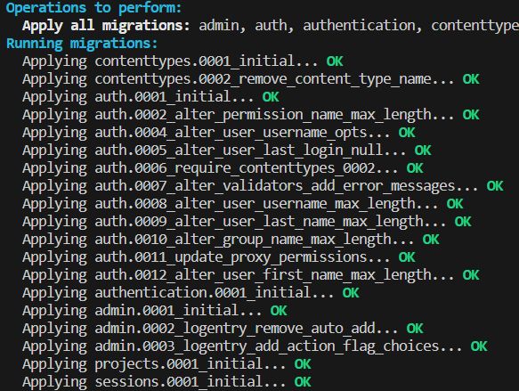
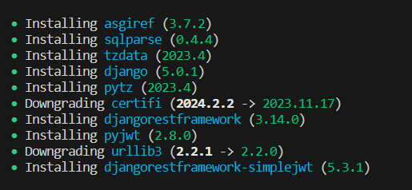

# SoftDesk API

## To install and use SoftDesk API, please follow these steps :

- Clone this repo into the location of your choice.
- Create a virtual environment into the folder of your project `python -m venv env`. 'env' can be replaced by the name of your choice.
- Activate it.
- Run `pip install poetry`.
- Run `poetry install`. These packages will appear :

- Run `python manage.py migrate`. These migrations will appear :

- Run `python manage.py runserver`

## To begin with SoftDesk 

- Launch Postman and send POST request : http://127.0.0.1:8000/api/user/ with the username, password and age of your choice
- Success response will appear with the user newly created
- Now you can create new project with POST request : http://127.0.0.1:8000/api/project/ with the name, description and type of your choice. After first project is created, you can add contributors to it with PATCH request by adding a User ID to 'contributors' parameter. 
- Now the first project is created, you can create an issue with POST request : http://127.0.0.1:8000/api/issue/ with the Project ID, the name, assigned_to (not mandatory) take a User ID in input, a priority and a tag
- After first issue is created, you can create a comment with POST request : http://127.0.0.1:8000/api/comment/ with the Issue ID and a description
